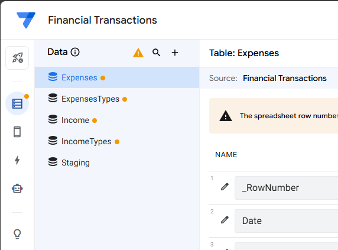
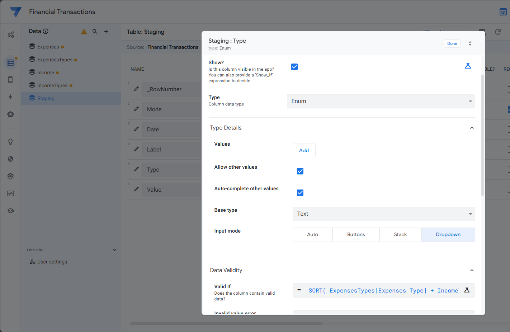
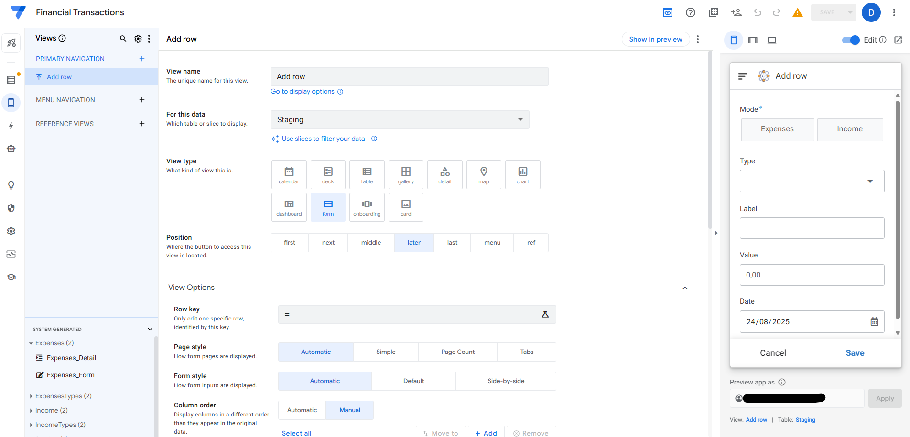

# Data Collector — Part 1 
*Building the foundation for personal finance tracking*

This project shows how to assemble a simple data collection app in AppSheet that writes directly into Google Sheets.  
The goal is to make expense and income logging effortless, so data quality stays high and consistent.


---

## All you need

- A **Google account** (free) 
- Access to **Google Sheets**
- An **AppSheet account** (linked to your Google account, free tier works)  
- 30 minutes of focused time  

No code required!


---

## Resources

For the "data base" We'll use and Google Sheet document with the following structure: 

- 1 document with 5 tabs:  
  - `Expenses` → for spending  
  - `Income` → for earnings  
  - `Staging` → temporary input buffer   
  - `ExpensesTypes` → distinct expense types  
  - `IncomeTypes` → distinct income types  

You can use this link to make a copy of the document in your google account. Make sure you enable editing and delete the dummy data from sheets Income/Expenses.

([https://docs.google.com/spreadsheets/d/FILE_ID/copy](https://docs.google.com/spreadsheets/d/1-7r4feTc4ek_SCIUcxHISn6DSkw-5M9H1cIISFR-xnI/copy))

While you are at it confirm the categories on the IncomeTypes/ExpensesTypes sheets; costumized them to feet your needs.

|  |  |
|----------------------------------|-----------------------------------|
---

## Step 1: Connect to AppSheet

- Go to [AppSheet](https://www.appsheet.com/)  
- **Start with your own data** → select your spreadsheet  
- In **Data → Tables**, add all 5 sheets  
- Regenerate each table so AppSheet recognizes the columns  



---

## Step 2: Configure Columns  

### In `Staging`  

- **Mode**  
  - Type: Enum  
  - Values: `Expenses`, `Income`  
  - Input mode: Buttons  

- **Label** → Text  

- **Type**  
  - Type: Enum  
  - Input mode: Dropdown  
  - **Valid_If**:  
    ```appsheet
    SWITCH(
      [Mode],
      "Expenses", SORT(ExpensesTypes[Expenses Type]),
      "Income",   SORT(IncomeTypes[Income Type]),
      LIST()
    )
    ```

- **Value** → Decimal (or Price)  

- **Date** → Date  
  - Initial value: `TODAY()`  



---

## Step 3: Build the Form  

- Go to **UX → Views → + New view**  
  - Name: `Add Row`  
  - For this data: `Staging`  
  - View type: Form  

- Column order: `Mode → Label → Type → Value → Date`  



---

## Step 4: Add the Actions  

Create 4 actions in **Behavior → Actions**:  

1. **Add to Expenses**  
   - For: `Staging`  
   - Do this: *Data: add new row to another table* (`Expenses`)  
   - Map: Date=[Date], Label=[Label], Type=[Type], Value=[Value]  
   - Only if: `[Mode]="Expenses"`  

2. **Add to Income**  
   - Same, target = `Income`  
   - Only if: `[Mode]="Income"`  

3. **Delete Staging row**  
   - For: `Staging`  
   - Do this: *Data: delete this row*  

4. **Submit (Grouped)**  
   - For: `Staging`  
   - Do this: *Grouped: execute a sequence of actions*  
   - Actions: Add to Expenses, Add to Income, Delete Staging  


---

## Step 5: Hook Submit to the Form  

- Go to **UX → Views → Add Row (Form)**  
- Under **Event actions → Form Saved** select `Submit`  
- Set **Auto save = ON** for smoother experience  


---

## Step 6: Test  

- Open the app preview (phone view)  
- Select **Expenses** → fill out form → Save  
  - Row should appear in `Expenses`, staging clears  
- Select **Income** → repeat  

|  |  |
|----------------------------------|-----------------------------------|


---

## In Summary

You now have:  
- A fast, structured data entry app  
- A clean database in Google Sheets  
- Categories pulled dynamically from lookup tables  

---

**Next (Part 2):** connect this database to reporting tools (Looker Studio) to generate insights.  


