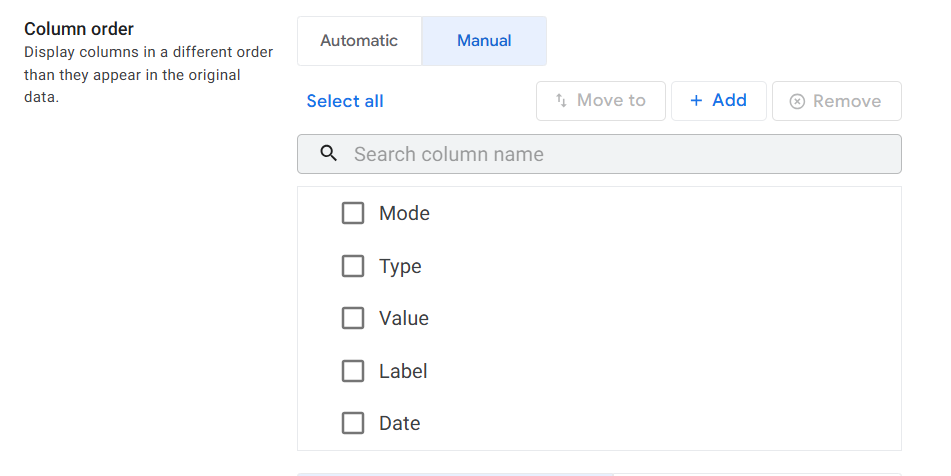
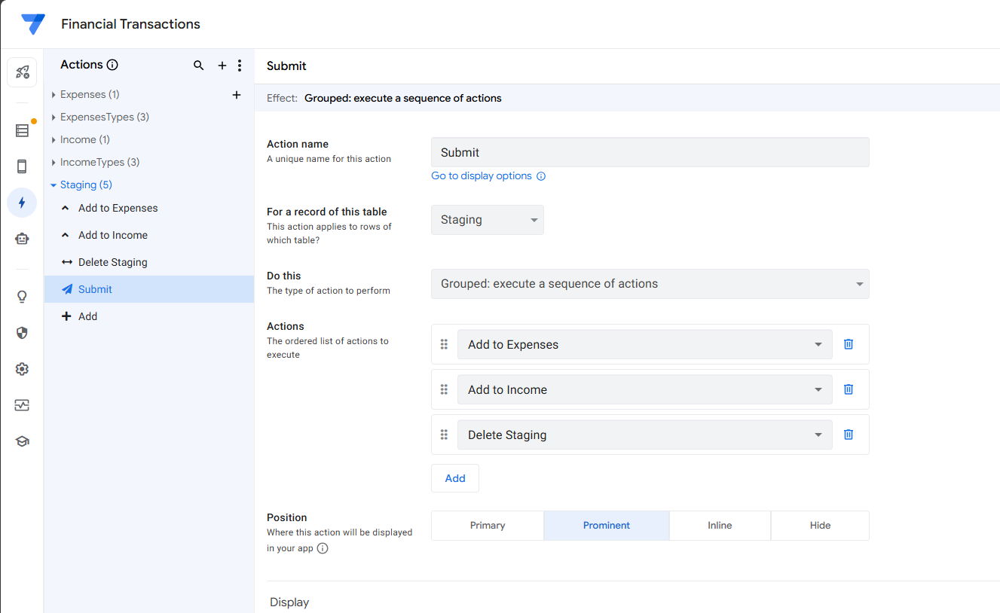

# Data Collector — Part 1 
*Building the foundation for personal finance tracking*

This project shows how to assemble a simple data collection app in AppSheet that writes directly into Google Sheets.  
The goal is to make expense and income logging effortless, so data quality stays high and consistent.


---

## All you need

- A **Google account** – free, and gives you access to all the services needed  
- Access to **Google Sheets** – we’ll create a single Google Sheets file with several tabs to function as your database
- An **AppSheet account** – the free tier lets you build an app you can use on your phone to write data directly to the spreadsheet  
- 30 minutes of focused time 

No code required!


|  |  |
|----------------------------------|-----------------------------------|


---

## Step 0: Set up the database

Before building the app, create the Google Sheets file that will act as your database.

#### Prepare your browser
1. Open a second browser window or profile and sign in to your [Google Drive](https://drive.google.com/).
2. Keep it open. This avoids account confusion when you follow the template link.

#### Make your own copy of the template
- I've built a template document you can copy to your account by pressing this [Template link](https://docs.google.com/spreadsheets/d/1-7r4feTc4ek_SCIUcxHISn6DSkw-5M9H1cIISFR-xnI/copy); Google will prompt “Make a copy.” Click it.  


- The file is saved to **your** Drive under your account (private by default). You can chnage the file name and location. This will not break any future connections since the app will connec to the file through "FILE_ID".
  


#### Confirm the structure
Your file should contain five tabs with these headers:

- `Expenses`: `Date | Label | Type | Value`
- `Income`: `Date | Label | Type | Value`
- `Staging`: `Mode | Date | Label | Type | Value`
- `ExpensesTypes`: `Expenses Type`
- `IncomeTypes`: `Income Type`


#### Clean and customize
- Delete any dummy rows from `Expenses` and `Income` (keep the header row). Also review categories in `ExpensesTypes` and `IncomeTypes` and edit to fit your needs. The categories you chose here are going to be the ones availble on th final App so chosse wisely

|  |  |
|----------------------------------|-----------------------------------|

---

## Step 1: Connect to AppSheet

- Go to [AppSheet](https://www.appsheet.com/); Sign-in with the uisng Google and sleect the same google account you used to store the Google Sheet document


- Lets add the Google Sheet as a database. Go to **Import from Sheets** and select your spreadsheet


- You should see it under Databases.


- Now we move to create the the App, we'll use the database we just created. Go to **Start with existing data**


- Then name it.


- Choose AppSheet database and find your data. After that **Create app**. You should then see something like this:


- Your App is live now, you can see a preview of it on the right. Before starting to work o it we need to do some configurations first.
---

## Step 2: Configure Columns  
On the right side panel, select **Data** and you can configure tables individually. Sellect the `Staging` table and edit the **Mode** columns.  


- **Mode**  
  - Type: Enum  
  - Values: add `Expenses`, `Income`  
  - Input mode: Buttons

  


For the remaining columns apply the following configurations

- **Label** → Text  

- **Type**  
  - Type: Enum  
  - Input mode: Dropdown
  - Find **Valid_If**: Insaert this code to make the rows in `ExpensesTypes` and `IncomeTypes` appear in a dropdown list for input on the final App.
    ```appsheet
    SORT(
        ExpensesTypes[Expenses Type] 
        + IncomeTypes[Income Type]
    )
    ```


- **Value** → Decimal
  
- **Date** → Date  
  - Initial value: `TODAY()`
 
For `Expenses` and `Income` tables, do

- **Value** → Decimal
  
- **Date** → Date  

Make sure you 'Save' on the top right corner (You may see a warning for the **Type** column in the `Staging` table. This can be safely ignored since the dropdown values are controlled by the `Valid_If` expression)

---

## Step 3: Build the Form  
With the configs done you can now work on the actual App on the **view** menu at the left hand panel.

  

You'll find some default views already. You can delete them if you want. Then

- Go to Views -> Primary Navigation -> + Add View do create a **New view**  
  - Name: `Add Row`  
  - For this data: `Staging`  
  - View type: Form  

  

You'll see a preview on the right

- Scroll down to set Column order: `Mode → Type → Value → Label → Date`  

  

---

## Step 4: Add the Actions  

By now this App will write a row to the `Staging` table whenever you press **Save**. We are not nished though. We need to add **Actions** so thta the correct information is moved to either the  `Expenses` or `Income` table. 

- Select the **Actions** menu at the left hand panel.

  

- Create 4 actions:  

1. Name: **Add to Expenses**  
   - For: `Staging`  
   - Do this: *Data: add new row to another table* (`Expenses`)  
   - Map: Date=[Date], Label=[Label], Type=[Type], Value=[Value]  
   - Only if this condition is true: `[Mode]="Expenses"`  

  


2. Name: **Add to Income**
   - For: `Staging`  
   - Do this: *Data: add new row to another table* (`Income`)  
   - Map: Date=[Date], Label=[Label], Type=[Type], Value=[Value]  
   - Only if this condition is true: `[Mode]="Income"`  

4. Name: **Delete Staging row**  
   - For: `Staging`  
   - Do this: *Data: delete this row*  

5. Name: **Submit**  
   - For: `Staging`  
   - Do this: *Grouped: execute a sequence of actions*  
   - Actions: Add to Expenses, Add to Income, Delete Staging  

By the end it should look something like this



---

## Step 5: Hook Submit to the Form  
To wrap it up, you'll make it so that the **Save** button activates our  `Submit`  **Action**

- Go to **UX → Views → Add Row**  
- Under **Event actions → Form Saved** select `Submit`  
- Set **Auto save = ON** for smoother experience  


---

## Step 6: Test  

- Open the app preview (phone view)  
- Select **Expenses** → fill out form → Save  
  - Row should appear in `Expenses`, staging clears  
- Select **Income** → repeat  

|  |  |
|----------------------------------|-----------------------------------|


---

## In Summary

You now have:  
- A fast, structured data entry app  
- A clean database in Google Sheets  
- Categories pulled dynamically from lookup tables  

---

**Next (Part 2):** connect this database to reporting tools (Looker Studio) to generate insights.  


